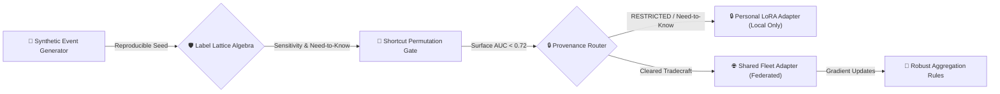

{ alt="A lighthouse casting three coloured sector beams into the dark" }
{ alt="A lighthouse casting three coloured sector beams across a pale sky" }

# Pharos

A labeled fleet testbed for federated personalization with a **governed disclosure boundary**.
{ .hero-subtitle }

[Get started](getting-started.md){ .md-button .md-button--primary }
[What has been measured](findings.md){ .md-button }

Sensitivity &nbsp;·&nbsp; Compartments &nbsp;·&nbsp; Capacity &nbsp;·&nbsp; Velocity-FL Rust

  

## The System Architecture { .section-title }

Pharos provides an end-to-end testbed for **lattice-governed disclosure** and **federated analyst fleets**.

### 🏷️ Security Label Lattice
Formal Partial Order Algebra over **Sensitivity Levels** (`OPEN` < `INTERNAL` < `PROTECTED` < `RESTRICTED`) and **Need-to-Know Compartments** (`[SENSOR]`, `[LIAISON]`, `[LEGAL]`, `[PARTNER]`). Defines exact Least Upper Bound joins ($\sqcup$) and dominance rules.

### 🎯 Permutation Shortcut Gate
Adversarial surface feature detector verifying that dataset class labels cannot be predicted by surface tells (sentence length, digit count, timestamp width) without reading narrative content ($z < 2.0$ null threshold).

### 🔒 Provenance Router & Ledger
SHA-256 decision ledger coupled with a boundary-gated router that splits analyst feedback between **Personal LoRA Adapters**, which never leave the holder, and **Shared Fleet Adapters**. Routing is per item; [finding 11](findings.md) shows that a per-item gate does not compose over a stream.

### 🧮 Robust Aggregation Rules
Server-side aggregation implemented from each rule's paper: `FedAvg`, `FedMedian`, `TrimmedMean`, `Krum`, `MultiKrum`, `Bulyan`, `GeometricMedian`, with sign-flip poisoning and a Gaussian DP mechanism to exercise them. Sized rather than settled: no claim from this module is quoted in the manuscript.

## The Core Problem { .section-title }

Federated personalization splits what a model learns into **local knowledge** and **shared knowledge**. Deciding *which* knowledge stays local versus what gets aggregated is a disclosure boundary problem that requires data with formal disclosure labels.
{ .section-lead }

!!! danger "Why public datasets fall short"
    Public corpora do not carry security compartment structures. At best, they provide a single linear sensitivity ladder where every label is comparable and a join is just a maximum. Real-world disclosure policy is not a ladder.

!!! info "The Pharos Solution"
    Two holders at the same sensitivity level with different need-to-know compartments are **incomparable**. Pharos generates synthetic datasets where labels carry this exact lattice structure, allowing researchers to measure privacy leakage, over-escalation, and personalization behavior against content-defined ground truth.

## Architecture & Modules { .section-title }

| Module | Purpose & Focus |
| :--- | :--- |
| [`pharos.labels`](reference/label-lattice.md) | **Label Algebra**: Sensitivity, compartments, capacity, joins, dominance, and declassification |
| `pharos.world` | **Synthetic Domain**: Maritime watch scenario, officer voices, and fact vocabulary |
| `pharos.scenario` | **Configuration Engine**: Load and configure custom watch environments from TOML |
| `pharos.generate` | **Deterministic Corpus**: Fully reproducible generation from `(seed, config)` |
| [`pharos.gate`](reference/gate.md) | **Shortcut Gate**: Probe to verify if class membership can be predicted without reading content |
| `pharos.manifest` | **Citable Ledger**: Versioning, seed tracking, gate verdicts, and label distribution histograms |
| `pharos.tasks` | **Analyst Tasks**: Governed label evaluation inherited directly from source evidence |
| `pharos.detect` | **Content Provenance**: Content-attribution labelling replacing naive leave-one-out methods |
| `pharos.attribute` | **Model Bridge**: The single isolated entry point for model inference calls |
| [`pharos.models`](models.md) | **Model Registry**: Registry of tested, verified, and candidate models |
| `pharos.validity` | **Validity Checker**: Conditions for determining if evaluation scores are statistically quotable |
| `pharos.provenance` | **Audit Stamps**: Version, git commit hash, and dirty-tree state tracking |
| [`pharos.export`](reference/corpus-schema.md) | **Data Export**: Reproducible JSON Lines exporter with cryptographic content hashing |
| [`pharos.croissant`](releasing.md) | **Open Metadata**: Emits Croissant metadata extended with Responsible AI fields |
| `pharos.telemetry` | **Observability**: Structured OpenTelemetry logs, tracing spans, and execution snapshots |
| [`pharos.web`](getting-started.md#visual-explorer-ui) | **Visual Explorer**: Interactive web UI for corpus, lattice, gate, and triage review |
| `pharos.cli` | **Command Line**: CLI subcommands (`gate`, `export`, `models`, `serve`) |

!!! note "Deterministic Pipeline"
    Everything in the generation and gating path is **100% offline**, and no model is contacted outside `pharos.attribute` and the evaluation scripts under `scripts/`.

    Reproducibility is exact where it has to be and approximate where it cannot be. The **corpus** is bit-identical across machines -- its SHA-256 agrees at every seed, which is what lets two parties discuss the same data. The gate's **score** is not: measured across a Ryzen laptop and a Xeon cluster node with identical library versions, 2 of 7 seeds differ by ~1e-05, because the BLAS selects kernels by processor and that changes reduction order inside the probe fit. No **verdict** moves, since the gap to the acceptance ceiling is four orders of magnitude larger. See [findings](findings.md) and `scripts/measure_gate_determinism.py`.

## Why "Pharos"? { .section-title }

Named after the Great Lighthouse of Alexandria—a watch station built to observe incoming activity and transmit signals to authorized mariners.
{ .section-lead }

!!! tip "Sector Light Analogy"
    Real lighthouses project **sector lights**: distinct color beams across different bearings so mariners know safe navigation paths relative to their location. In Pharos:
    
    * **Sensitivity** defines how far a message travels (distance).
    * **Compartments** define along which bearings it can be seen (angle).
    * Two holders in different sectors are **incomparable**, not ranked.

## Core References { .section-title }

This documentation site serves as the operational reference guide for running Pharos and understanding its internal mechanics.
{ .section-lead }

* 📊 **[Findings & Benchmarks](findings.md)**: Index of all measured findings, provisional numbers, and reproduction scripts.
* 📜 **`RESEARCH.md`**: Analysis of existing public corpora, domain trade-offs, and verified citations.
* 🛡️ **System Design Specs**: Detailed system architecture lives in the [Federated Analyst Fleets](https://github.com/ajbarea/kourai-khryseai) specification docs (`pharos-testbed.md` for this testbed, `index.md` for the Kourai Khryseai fleet harness).

