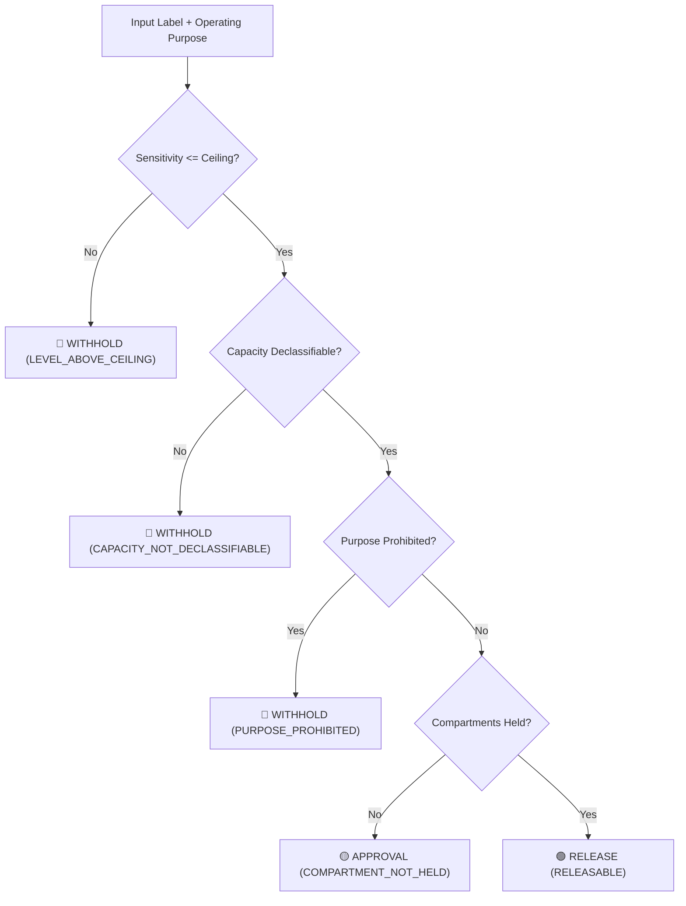

# The Release Decision

`pharos.disclosure` evaluates whether derived outputs may leave an enclave, why, and when an analyst or authority must review the decision.

## Decision Evaluation Flowchart



---

## Three Governance Dispositions


Unlike binary boolean gates, Pharos enforces three explicit governance dispositions:

| Disposition | Meaning | Operational Action |
| :--- | :--- | :--- |
| **`RELEASE`** | Approved for immediate release | Leaves without human intervention |
| **`APPROVAL`** | Blocked, but authorizable | Escalates to human authority for compartment clearance |
| **`WITHHOLD`** | Strictly blocked | Cannot be released under any authority |

!!! note "Why Approval Matters"
    A compartment shortfall is an **authorizable policy decision**. Distinguishing `APPROVAL` from `WITHHOLD` prevents permanent blockades on outputs where human authorities have clearance to override compartment restrictions.

---

## Governed Reason Codes

Every release decision emits an explicit reason code to support auditing and provenance tracking:

| Reason Code | Disposition | Root Cause & Resolution |
| :--- | :--- | :--- |
| **`RELEASABLE`** | `RELEASE` | Passes all lattice dominance and policy checks |
| **`COMPARTMENT_NOT_HELD`** | `APPROVAL` | Requires clearance from an authority holding the target compartment |
| **`LEVEL_ABOVE_CEILING`** | `WITHHOLD` | Sensitivity level exceeds aggregator ceiling |
| **`CAPACITY_NOT_DECLASSIFIABLE`** | `WITHHOLD` | Output format (e.g. `FREETEXT`) is ineligible for release |
| **`PURPOSE_PROHIBITED`** | `WITHHOLD` | Use case is prohibited by data owner restrictions |

!!! warning "Most-Binding Ordering"
    Reason evaluation is **ordered by severity**. A label failing multiple checks reports the most restrictive, non-liftable reason (e.g. `LEVEL_ABOVE_CEILING` over `COMPARTMENT_NOT_HELD`).

---

## Purpose Limitation Axis

Clearance and sensitivity evaluate *who* may read data. **Purpose limitation** evaluates *what the reading is used for*:

```python
from pharos.disclosure import ProhibitedUse, Purpose, ReleasePolicy, decide

policy = ReleasePolicy(
    declassification=DROP_COMPARTMENTS,
    prohibited=frozenset({ProhibitedUse(Compartment.LEGAL, Purpose.FLEET_TRAINING)}),
)

# Evaluating same label under different operational purposes:
decide(label, ceiling, policy, purpose=Purpose.FLEET_TRAINING).disposition  # WITHHOLD
decide(label, ceiling, policy, purpose=Purpose.INCIDENT_REVIEW).disposition  # RELEASE
```

---

## Governance Function Distinction

| Function | Input | Purpose |
| :--- | :--- | :--- |
| **`decide(...)`** | **Source Data Label** | Applies full declassification policies to original evidence |
| **`admit(...)`** | **Derived/Released Output** | Verifies an already-declassified proposal (prevents double declassification) |

---

## Audited Case Verification

Pharos maintains a verified suite of disclosure test cases in `src/pharos/cases/disclosure.json`.

```bash
# Run verified disclosure test cases
uv run python -m pytest tests/test_disclosure.py -q
```

