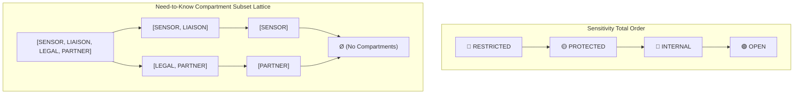

# The Label Lattice

In Pharos, security and disclosure labels follow a three-element product lattice:

```text
label = (sensitivity, compartments, capacity)

sensitivity  : OPEN < INTERNAL < PROTECTED < RESTRICTED    (Total order, join = max)
compartments : subset of {SENSOR, LIAISON, LEGAL, PARTNER} (Subset lattice, join = union)
capacity     : ENUM | SCALAR | SPAN | FREETEXT             (Derived output format)
```

## Security Lattice Partial Order Diagram



!!! note "Lattice vs. Ladder Security Models"
    Sensitivity operates as a linear ladder. **Compartments do not**. Two holders at `RESTRICTED` with disjoint compartment sets dominate each other in neither direction. This incomparability is what defines a true **security lattice**.

---


## Dominance Algebra

```python
from pharos.labels import Capacity, Compartment, Label, Sensitivity

holder = Label(Sensitivity.RESTRICTED, frozenset({Compartment.SENSOR}), Capacity.FREETEXT)
item = Label(Sensitivity.INTERNAL, frozenset({Compartment.PARTNER}), Capacity.FREETEXT)

holder.dominates(item)  # Returns False: holder outranks level, but lacks PARTNER compartment
```

!!! info "Dominance Condition"
    `holder.dominates(item)` evaluates to `True` if and only if **both**:
    1. `holder.sensitivity >= item.sensitivity`
    2. `holder.compartments >= item.compartments` (subset containment)

---

## Lattice Join Operations

```python
from pharos.labels import join

# Returns the join over source labels with specified output capacity
join(source_labels, capacity=Capacity.ENUM)
```

* **Sensitivity Join**: Evaluated as the maximum level across all source labels ($\max$).
* **Compartment Join**: Evaluated as the union of all source compartment sets ($\bigcup$).
* **Capacity**: Explicit output format specified per derived task (does not scale upward, preventing label creep).

---

## Declassification Policies

```python
from pharos.labels import DeclassificationPolicy, declassify, shared_eligible

policy = DeclassificationPolicy()  # Fail-closed default policy
declassify(label, policy)
shared_eligible(label, release_ceiling, policy)
```

| Policy Field | Default Value | Purpose & Function |
| :--- | :--- | :--- |
| `declassifiable` | `{ENUM, SCALAR}` | Output capacities eligible for automated release |
| `release_floor` | `OPEN` | Target sensitivity level upon declassification |
| `drop_compartments` | `False` | Determines whether declassification sheds source compartments |

!!! danger "Fail-Closed Defaults"
    1. **Unlisted Capacities**: Any output capacity not named in `declassifiable` is withheld without declassification.
    2. **Compartment Survival**: Compartments survive declassification unless `drop_compartments=True` is explicitly configured.

---

## The Load-Bearing Impact of `drop_compartments`

Across 40 triage turns with an average of 1.98 compartments per report:

| Policy Configuration | FREETEXT | SPAN | SCALAR | ENUM |
| :--- | :---: | :---: | :---: | :---: |
| **Keep Compartments** (Fail-Closed Default) | 0–50% | 0–50% | 0–50% | 0–50% |
| **Drop Compartments** (Low-Capacity Release) | 0–50% | 0–50% | **100%** | **100%** |

!!! summary "Federation Consequence"
    Keeping compartments limits federation eligibility to **0–50%**. Dropping compartments for low-capacity verdicts permits **100% federation** of structured outputs while keeping prose restricted.

